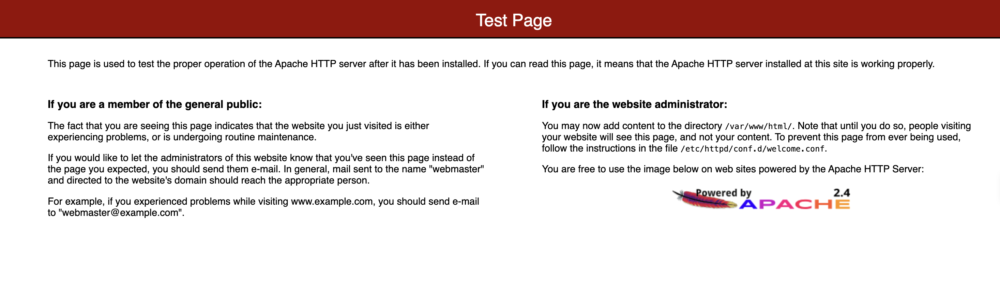
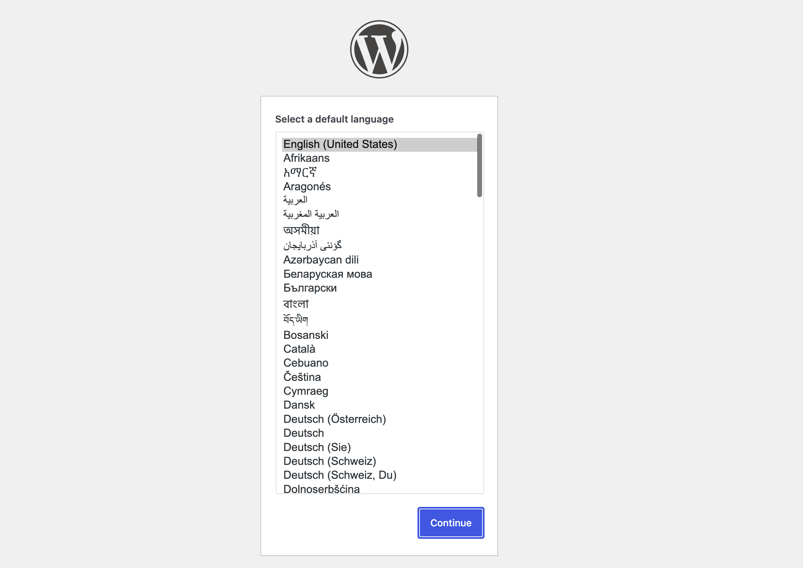

# WordPress on AWS EC2 — Terraform Deployment

CoderCo DevOps Bootcamp — Assignment 1

## Overview

This project provisions a self-hosted WordPress site on AWS using Terraform. All networking is defined explicitly in code rather than relying on AWS's default VPC, and the EC2 instance bootstraps itself on first boot via a `user_data` script (installs Apache, MariaDB, PHP, and WordPress with no manual server setup).

**Live result:** a working WordPress installation reachable over HTTP on a public IP, built from a single `terraform apply`.

## Architecture

7 resources, all created in `eu-west-2` (London):

```
Internet
   │
   ▼
Internet Gateway ── attached to ──▶ VPC (10.0.0.0/16)
   ▲                                     │
   │                              Subnet (10.0.1.0/24)
Route Table  ──── associated with ───────┤
(0.0.0.0/0 → IGW)                        │
                                    Security Group (80, 22)
                                          │
                                    EC2 Instance (t3.micro)
                                    Amazon Linux 2
                                    └─ user_data bootstraps:
                                        Apache, MariaDB, PHP 8, WordPress
```

| # | Resource | Purpose |
|---|----------|---------|
| 1 | `aws_vpc.this` | Isolated network container for the deployment |
| 2 | `aws_subnet.public` | Slice of the VPC the instance actually lives in |
| 3 | `aws_internet_gateway.this` | Gives the VPC a path in/out to the internet |
| 4 | `aws_route_table.public` | Routes all outbound traffic (`0.0.0.0/0`) through the IGW |
| 5 | `aws_route_table_association.public` | Attaches the route table to the subnet |
| 6 | `aws_security_group.wordpress_sg` | Opens ports 80 (HTTP) and 22 (SSH) |
| 7 | `aws_instance.this` | The EC2 instance running WordPress |

The AMI is resolved dynamically via a `data "aws_ami"` lookup (latest Amazon Linux 2, owned by Amazon) rather than a hardcoded, region-specific ID.

## Prerequisites

- Terraform installed
- AWS CLI configured (`aws configure`) with credentials that have EC2/VPC permissions
- An existing EC2 key pair in the target region (for SSH access)

## Usage

```bash
terraform init
terraform apply
```

You'll be prompted for `db_password` (the password for the WordPress database user). To avoid re-entering it on every apply, either:

```bash
export TF_VAR_db_password="your-chosen-password"
```

or create a `terraform.tfvars` file (gitignored — never commit this):

```
db_password = "your-chosen-password"
```

After `apply` finishes, give the instance 1–2 minutes to finish bootstrapping, then visit the `public_ip` output in a browser.

## Variables

| Name | Type | Default | Notes |
|------|------|---------|-------|
| `aws_region` | string | `eu-west-2` | |
| `instance_type` | string | `t3.micro` | |
| `db_password` | string | *(none — required)* | Marked `sensitive`, no default on purpose |

## Outputs

| Name | Description |
|------|-------------|
| `instance_id` | EC2 instance ID |
| `public_ip` | Use this to access the WordPress site |

## Screenshots

**Before fix** — Apache's default test page, meaning the boot script failed partway through:



**After fix** — WordPress's own install wizard, confirming PHP is now parsing and executing WordPress correctly:



## Issues Encountered & Fixes

Debugging this deployment surfaced several real issues — documenting them here since working through them was most of the learning value of this assignment.

1. **Default VPC had no subnets.** After an earlier module's coursework, I'd manually deleted the default VPC's subnets to avoid ongoing charges. This meant `terraform apply` failed with `MissingInput: No subnets found for the default VPC`. Rather than just recreating the default subnet, I chose to define the VPC, subnet, internet gateway, route table, and association explicitly in Terraform — more idiomatic IaC, and it means the deployment no longer depends on implicit AWS account defaults at all.

2. **Key pair / region mismatch.** The EC2 key pair existed in `eu-west-2`, but the provider block was still hardcoded to `us-east-1`. Terraform couldn't find the key pair and failed with `InvalidKeyPair.NotFound`. Fixed by pointing the provider at `eu-west-2` (matching the AWS CLI's configured default region).

3. **`CREATE USER IF NOT EXISTS` unsupported.** Amazon Linux 2 ships MariaDB 5.5, which predates the `IF NOT EXISTS` syntax on `CREATE USER`. Combined with `set -e` in the `user_data` script, this caused a silent failure partway through — Apache installed and started, but the script never reached the WordPress download/config steps, so visiting the site just showed Apache's default page. Fixed by dropping `IF NOT EXISTS` (safe here since `user_data` only ever runs once, on first boot).

   Because `user_data_replace_on_change` is `false`, editing the script alone doesn't trigger a rebuild — had to explicitly force it with:
   ```bash
   terraform taint aws_instance.this
   terraform apply
   ```

4. **PHP 5.4 too old for modern WordPress.** With the database bug fixed, the script ran end-to-end, but the site returned a blank HTTP 500. Apache's error log showed a PHP parse error in a WordPress core file — Amazon Linux 2's default yum repo installs PHP 5.4 (over a decade old), while `wordpress.org/latest.tar.gz` always pulls a current WordPress release that requires PHP 7.2+. Fixed by switching the PHP source before installing:
   ```bash
   amazon-linux-extras enable php8.0
   yum clean metadata
   ```

## Key Learnings

- `user_data` only executes on an instance's *first* boot — changing the script requires tainting and recreating the instance (or enabling `user_data_replace_on_change`).
- `set -e` catches bugs early but fails silently line-by-line with no indication of *which* line, unless you go and check `/var/log/cloud-init-output.log` yourself.
- A "default VPC" isn't magic, it's just a VPC + subnets + IGW + route table that AWS pre-creates for you. Deleting parts of it doesn't delete the whole thing, and it's entirely rebuildable in Terraform.
- The AWS Console's region selector is independent of Terraform's configured region — resources can exist and be fully functional while simply not visible because the console is pointed at a different region tab.
- OS base images lag behind current software requirements (Amazon Linux 2's default PHP is over 10 years old) — always worth checking what a base AMI actually ships before assuming a fresh install "just works."

## Security Notes

Both HTTP (80) and SSH (22) are open to `0.0.0.0/0` for simplicity in this learning environment. In a production setup, SSH access should be restricted to a specific IP range, and the instance was seen being probed by automated bots within hours of going live — expected background internet noise for anything with an open port, but a good reminder of why this restriction matters in practice.

---
*Built as part of the CoderCo DevOps Bootcamp.*