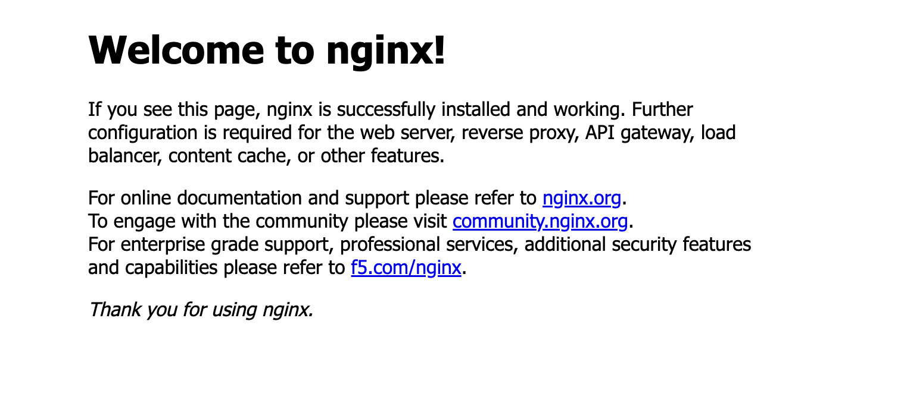

# Nginx on AWS EC2 via cloud-init — Terraform Deployment

CoderCo DevOps Bootcamp — Assignment 2

## Overview

This project provisions an EC2 instance that installs and starts Nginx automatically on first boot, using a `cloud-config` YAML file passed as `user_data`, no manual SSH steps required to get the web server running.

**Live result:** the Nginx default welcome page, reachable over HTTP on a public IP, from a single `terraform apply`.

## Architecture

Same shape as Assignment 1, a fully self-contained network with nothing relying on AWS account defaults:

```
Internet
   │
   ▼
Internet Gateway ── attached to ──▶ VPC (10.0.0.0/16)
   ▲                                     │
   │                              Subnet (10.0.1.0/24)
Route Table  ──── associated with ───────┤
(0.0.0.0/0 → IGW)                        │
                                    Security Group (80, 22)
                                          │
                                    EC2 Instance (t3.micro)
                                    Amazon Linux 2
                                    └─ cloud-init (YAML) bootstraps:
                                        Nginx, via amazon-linux-extras
```

| # | Resource | Purpose |
|---|----------|---------|
| 1 | `aws_vpc.this` | Isolated network container for the deployment |
| 2 | `aws_subnet.public` | Slice of the VPC the instance actually lives in |
| 3 | `aws_internet_gateway.this` | Gives the VPC a path in/out to the internet |
| 4 | `aws_route_table.public` | Routes all outbound traffic (`0.0.0.0/0`) through the IGW |
| 5 | `aws_route_table_association.public` | Attaches the route table to the subnet |
| 6 | `aws_security_group.nginx_sg` | Opens ports 80 (HTTP) and 22 (SSH) |
| 7 | `aws_instance.this` | The EC2 instance running Nginx |

The AMI is resolved dynamically via a `data "aws_ami"` lookup (latest Amazon Linux 2, owned by Amazon) rather than a hardcoded, region-specific ID.

## cloud-init vs a bash user_data script

Assignment 1 used a plain bash script (`#!/bin/bash`) as `user_data`. This assignment instead uses `cloud-config`, a declarative YAML format cloud-init also understands — the file starts with `#cloud-config` instead of a shebang, and cloud-init parses it as structured configuration rather than raw shell commands.

`nginx-cloud-init.yaml`:
```yaml
#cloud-config
runcmd:
  - amazon-linux-extras install -y nginx1
  - systemctl start nginx
  - systemctl enable nginx
```

Referenced in `main.tf` via:
```terraform
user_data = file("nginx-cloud-init.yaml")
```

## Prerequisites

- Terraform installed
- AWS CLI configured (`aws configure`) with credentials that have EC2/VPC permissions
- An existing EC2 key pair in the target region (for SSH access)

## Usage

```bash
terraform init
terraform apply
```

After `apply` finishes, give the instance a minute to finish bootstrapping, then visit the `public_ip` output in a browser.

## Variables

| Name | Type | Default | Notes |
|------|------|---------|-------|
| `aws_region` | string | `eu-west-2` | |
| `instance_type` | string | `t3.micro` | |

## Outputs

| Name | Description |
|------|-------------|
| `instance_id` | EC2 instance ID |
| `public_ip` | Use this to access the Nginx welcome page |

## Screenshot

Nginx's default welcome page, confirming cloud-init installed and started it correctly with zero manual steps:



## Issues Encountered & Fixes

1. **`data.aws_ami` declared but never used.** When copying the Assignment 1 structure over, the `aws_instance` block referenced `local.instance_ami` and `local.instance_name`, but no `locals` block existed in this new root module to define them, each Terraform root module is fully self-contained and doesn't inherit anything from a sibling folder. Fixed by adding an explicit `locals` block that maps `instance_ami` to the AMI data lookup.

2. **Instance not placed inside the custom VPC.** The `aws_instance` block was initially missing `subnet_id` and `vpc_security_group_ids`, which would have caused AWS to fall back to the (empty) default VPC and fail with the same `MissingInput: no subnets found` error from Assignment 1. Fixed by explicitly setting both to the custom VPC's subnet and security group.

3. **Security group's `vpc_id` was commented out.** This would have caused the security group to attempt attaching to the default VPC while the instance lived in the custom VPC, an invalid combination AWS rejects outright. Fixed by uncommenting `vpc_id = aws_vpc.this.id`.

4. **`nginx` not available in the base yum repo.** The site didn't load after a successful `apply`. `cloud-init-output.log` showed:
   ```
   No package nginx available.
   nginx is available in Amazon Linux Extra topic "nginx1"
   ```
   Amazon Linux 2's default yum repo doesn't carry `nginx` at all, it's only available through `amazon-linux-extras`, a separate curated package source (the same category of issue as PHP 5.4 being the only yum-default option in Assignment 1). The `packages:` directive in `cloud-config` only reaches the base repo, so the install silently failed, and the subsequent `runcmd` step trying to start Nginx failed too, since it was never installed. Fixed by dropping `packages:`/`package_update:` entirely and installing via `amazon-linux-extras install -y nginx1` inside `runcmd` instead.

   As with the PHP fix in Assignment 1, `user_data_replace_on_change` is `false`, so editing the YAML alone doesn't trigger a rebuild — had to force it:
   ```bash
   terraform taint aws_instance.this
   terraform apply
   ```

## Key Learnings

- Each Terraform root module is fully independent — copying a `.tf` file that *uses* a resource doesn't bring along the block that *defines* it. Every root module needs its own complete set of declarations.
- `cloud-config` YAML and a bash `user_data` script are two different syntaxes for the same underlying mechanism — cloud-init reads the first line (`#cloud-config` vs `#!/bin/bash`) to decide how to interpret everything below it.
- Amazon Linux 2's base yum repo is deliberately minimal — several common packages (PHP 7+, Nginx) only exist via `amazon-linux-extras`, worth checking a package's actual availability before assuming `packages:` or `yum install` will find it.
- Reading cloud-init logs top-to-bottom matters: one root-cause failure (missing package) can cascade into a second, seemingly unrelated failure lower in the log (`runcmd` failing to start a service that was never installed).

## Security Notes

Both HTTP (80) and SSH (22) are open to `0.0.0.0/0` for simplicity in this learning environment. In a production setup, SSH access should be restricted to a specific IP range.

---
*Built as part of the CoderCo DevOps Bootcamp.*